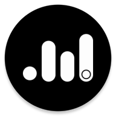

<div align="center">



# MusicBox 🎵

### *The Premium Offline Music & Video Experience for Android*

[](https://github.com/shejanahmmed/MusicBox---Offline-Music-Player-App/releases)
[](LICENSE)
[-00E5FF?style=for-the-badge&logo=android&logoColor=white)](https://developer.android.com/)
[](https://kotlinlang.org/)

<p align="center">
  <a href="#-key-features"><b>Key Features</b></a> •
  <a href="#-whats-new-in-v200"><b>What's New (v2.0.0)</b></a> •
  <a href="#-architecture--tech-stack"><b>Tech Stack</b></a> •
  <a href="#-download"><b>Download</b></a> •
  <a href="#-changelog"><b>Changelog</b></a> •
  <a href="#-author"><b>Author</b></a>
</p>

---

</div>

## 🚀 Overview

**MusicBox** is an open-source, ad-free, and privacy-first offline music and video player crafted for users who demand **visual elegance** and **premium performance**.

Built using modern Android development architectures (Kotlin, Coroutines, MVVM, Clean Architecture), it merges a buttery-smooth **Glassmorphic UI** with a powerful local playback engine. MusicBox stands out with its **procedural vinyl cover engine** (generating vintage record artwork for track files missing cover metadata) and interactive micro-animations (like Instagram-style favorite pops and spring-based fast-scroll indicators).

---

## ✨ Key Features

### 🎨 Premium Visual Experience
*   **Glassmorphic Design:** Translucent, adaptive interface components that dynamically tone and blur based on active album art.
*   **Vintage Vinyl Engine:** Generates procedurally rendered retro vinyl records with realistic textures and animations for files without embedded covers.
*   **Interactive Micro-interactions:** Tactile feedback on controls and a spring-loaded Instagram-style favorite animation.
*   **Edge-to-Edge Layout:** Immersive layout that extends content directly behind the system status and navigation bars.

### 🎛️ Immersive Audio & Video Engine
*   **Precision Equalizer:** Completely customized EQ controller with smooth `VerticalSeekBar` tracking and quick preset modes (Rock, Pop, Classical, etc.).
*   **Seamless Playback & Service:** Gapless audio transitions powered by a background-robust `MusicSession` implementation.
*   **Swipe-to-Control Mini Player:** Easily swipe left or right to skip tracks, tap to pause, or expand into the full player.
*   **Advanced Video Player:** Full-featured local video hub with custom duration filtering, sorting options, and dedicated metadata inspect panels.

### 📂 Advanced Library & Queue Control
*   **On-the-Fly Queueing:** Prepend or append songs to your active playlist with "Play Next" and "Play Last" action buttons.
*   **Dynamic Fast-Scroll:** Enhanced scrolling layout with letter-bubble tracking and custom scroll-indicator pill visibility.
*   **Local Metadata Editor:** Edit titles, artists, and album fields directly inside the app, persisting changes directly.
*   **Safe-Keep Deleted Trash:** Hidden audio/video clips go into a trash folder where they can be restored or permanently purged.

### 🛡️ Privacy & Reliability
*   **100% Offline operation:** No telemetry, zero internet connections, completely private.
*   **Ad-Free forever:** Transparent open-source license with no monetization or trackers.

---

## ⚡ What's New in v2.0.0

The **v2.0.0 Release** marks a significant evolution in MusicBox's UI/UX and audio performance:

| Feature | Description |
| :--- | :--- |
| **🎛️ Redesigned Equalizer** | Replaced standard sliders with beautiful custom `VerticalSeekBar` elements featuring precise visual tracking, interactive labels, and instant-apply preset chips. |
| **❤️ Micro-Interaction Pops** | Added a spring-elastic Instagram-style pop animation to favorite buttons inside the metadata drawer and Now Playing screen. |
| **🔀 Queue Injection** | Introduced `Play Next` and `Play Last` controls in the track action menu to dynamically manage playback without interrupting current queues. |
| **⚡ Smooth Fast-Scroll** | Fixed animation clipping and physics of the list scroll indicator, introducing an expanded touch target and a dynamic letter bubble. |
| **📜 Marquee Path Viewer** | Upgraded static path widgets to an elegant auto-scrolling marquee path visualizer within the track properties menu. |
| **🔄 Background Stability** | Fixed playback drops by ensuring explicit `MusicService` initialization for state persistence across background lifecycles. |

---

## 🏗️ Architecture & Tech Stack

MusicBox is built with **Clean Architecture** patterns under the **MVVM** architecture paradigm:

```text
com.shejan.musicbox
├── activities      # UI entry points & main activities
├── adapters        # High-performance list & media recyclers
├── managers        # Domain logic, miniplayer handlers, track actions
├── models          # Immutable domain data models
├── services        # Background playback & media service lifecycle
└── utils           # Extension libraries, view animations, helpers
```

### Technical Specifications
*   **Core Language:** [Kotlin](https://kotlinlang.org/) (100% codebase)
*   **Asynchronous Processing:** Kotlin Coroutines & StateFlow/SharedFlow
*   **User Interface:** XML layouts with custom Material Design components & Lottie animations
*   **System Integration:** Android Jetpack libraries, MediaSession, and Foreground Services
*   **Image Loading:** Glide (optimized caching & blur transformations)

---

## 📥 Installation

MusicBox is available for install via official channels:

<table align="center">
  <tr>
    <td align="center">
      <a href="https://play.google.com/store/apps/details?id=com.shejan.musicbox">
        <br/>
        <b>Google Play Store</b>
      </a>
    </td>
    <td align="center">
      <a href="https://github.com/shejanahmmed/MusicBox---Offline-Music-Player-App/releases">
        <br/>
        <b>Direct APK Releases</b>
      </a>
    </td>
  </tr>
</table>

---

## 📋 Changelog

### v2.0.0 _(Current Release)_
- **🎛️ Equalizer Refactor:** Replaced standard sliders with beautiful custom `VerticalSeekBar` elements featuring precise visual tracking, interactive labels, and instant-apply preset chips.
- **❤️ Micro-Interaction Pops:** Added a spring-elastic Instagram-style pop animation to favorite buttons inside the metadata drawer and Now Playing screen.
- **🔀 Queue Injection:** Introduced `Play Next` and `Play Last` controls in the track action menu to dynamically manage playback without interrupting current queues.
- **⚡ Smooth Fast-Scroll:** Replaced standard Android scrollbars with a custom dynamic pill, expanded touch targets, and fixed ViewPropertyAnimator bugs to ensure buttery-smooth fast scrolling and proper letter bubble animations.
- **📜 Marquee Path Viewer:** Upgraded static path widgets to an elegant auto-scrolling marquee path visualizer within the track properties menu.
- **🔄 Background Stability:** Fixed playback drops by ensuring explicit `MusicService` initialization for state persistence across background lifecycles.
- **📐 Onboarding Polish:** Polished layout alignment, resolved rendering/animation clipping issues, and added dynamic layout-height equalizer animation loops.
- **✅ Global Version Alignment:** Full upgrade of all files (gradle files, activities, setting panels, resources) to official release version `2.0.0`.

### v1.6.5
- 🎨 **Premium Theme Enhancements**: Significantly improved both **Light and Dark modes** with refined color palettes (Premium Ash) and better contrast.
- 💎 **Sleek UI Design**: Enhanced card layouts, buttons, and iconography across the app for a more professional and modern aesthetic.
- 🛠️ **UI Layout Fixes**: Increased bottom padding in all scrollable lists (Tracks, Albums, etc.) to prevent content from being hidden behind the mini-player.
- 📐 **Navigation Refinement**: Adjusted "Now Playing" header spacing and alignment for better visual balance.
- ✅ **Version Alignment**: Standardised versioning to v1.6.5 (Build 15).

### v1.6.0
- ⚙️ **Home Customization**: Added comprehensive settings to reorder and hide boxes on the Home screen.
- 🎨 **Visual Tweaks**: Navigation and layout improvements across list items.

### v1.3.1
- 🎬 **Videos Page**: Dedicated tab for browsing local video files with sort controls.
- ⋮ **Video Options Menu**: Full options dialog for videos (share, favorite, playlist, metadata, delete).
- ⏱️ **Video Duration Filter**: Set min/max duration range for the video library in Settings.
- 🗑️ **Deleted Videos**: Hidden videos now appear in Deleted Tracks folder with restore support.
- 🖥️ **Edge-to-Edge UI**: App background extends seamlessly behind the status bar on all devices.
- 🐛 **Bug Fixes**: Resolved double video load on launch, SharedPrefs anti-pattern, missing deprecation suppressions.

### v1.2.0
- Initial Videos page with navigation.
- Library Preferences section in Settings.
- Audio track duration filter.

---

## 🤝 Contributing

We welcome community feedback, pull requests, and suggestions!

1. **Fork** the repository
2. **Create** a branch (`git checkout -b feature/AmazingFeature`)
3. **Commit** your changes (`git commit -m 'feat: Add AmazingFeature'`)
4. **Push** to the branch (`git push origin feature/AmazingFeature`)
5. **Open** a Pull Request

---

## 👥 Authors & Contributors

**Shejan Ahmmed** — Lead Developer & Designer

<p align="left">
  <a href="https://shejan.me">
    
  </a>
  <a href="https://github.com/shejanahmmed">
    
  </a>
  <a href="https://www.linkedin.com/in/farjan-ahmmed/">
    
  </a>
  <a href="mailto:farjan.swe@gmail.com">
    
  </a>
</p>

---

## 📄 License

This project is licensed under the **GNU General Public License v3.0** - see the [LICENSE](LICENSE) file for details.

<div align="center">
  <sub>Built with precision, style, and passion. © 2026 Shejan Ahmmed.</sub>
</div>
